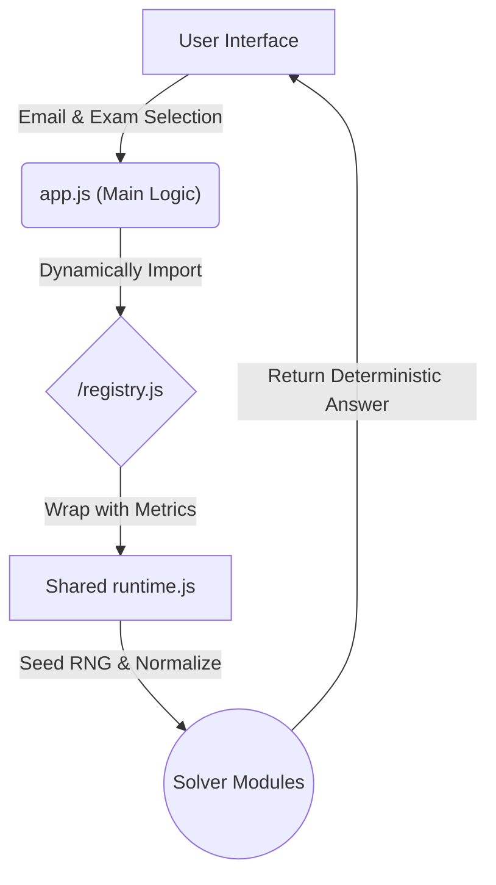

# TDS Exam Portal — Elite Workspace


A production-ready, browser-based workspace for executing deterministic solver logic across IIT Madras Tools in Data Science (TDS) exams. 

Designed as a sleek, dynamic frontend with a lightweight local server, the portal dynamically loads exam-specific solver registries and executes them instantly entirely within the user's browser.

---

## 🏗️ Deterministic Architecture

To guarantee 100% consistent results offline, the architecture is built around two critical "God nodes":

1. **`normalizeEmail()`**: Acts as the global input anchor, ensuring that variations in user email inputs are standardized before computation.
2. **`rng()`**: A tightly controlled seeded random number generator. The normalized email is injected as the seed across all solvers, guaranteeing that random choices, array shuffles, and dynamic variable selections are identical every time for a given user.

### Execution Flow



---

## 🎯 Supported Exam Engines

The registry currently supports the following TDS targets:

| Target | Description | Capabilities |
|--------|-------------|--------------|
| **GA0** | TDS Introduction | Standard 25-question suite with Markdown instructions |
| **ROE** | Re-exam workflows | Regex golf, mazes, programmatic computation |
| **GA7** | Data Visualization | Diverging palettes, prompt reverse engineering |
| **GA8** | MLOps & Cloud deployments | Docker, FastAPI, GCP Cloud Run, Gemini API, HF Spaces |
| **Project 2** | Interactive KB Solvers | QR Forensics (Solana tracer), Discourse KB (50 exact tasks) |

---

## T22026 GA0 Production Notes

The T22026 GA0 engine is aligned with the official May 2026 GA0 bundle:

- Official ID/order parity is checked against all 25 question IDs.
- Seeded solvers mirror the exam bundle's `seedrandom` behavior where the official question depends on email.
- High-risk tasks have validator-compatible outputs: `/code-interpreter`, FastAPI student filtering, batch sentiment, image jigsaw reconstruction, Unicode sums, DevTools secret, and Vercel latency metrics.
- `npm run check` executes every GA0 solver for multiple representative emails so user-specific variants do not silently regress.

---

## ✨ Workspace UX

The portal is designed as a power-user IDE rather than a simple results page:

- **Dynamic Welcome Screen**: Reads `tds-config.json` on startup to easily update term info each semester without touching code.
- **Glassmorphism & Aesthetics**: Custom dark scrollbars, `backdrop-filter: blur(12px)` headers, tactile buttons, and pulsing progress bars.
- **Mobile Drawer Navigation**: Responsive full-height slide-out drawer utilizing natural document-flow scrolling.
- **Interactive Previews**: HTML preview iframes for rendering document outputs directly.
- **Health Indicators**: Per-question status badges indicating runtime execution speed, stability, and warning counts.
- **Frictionless Copying**: Fallback clipboard support and one-click debug report generation.
- **Persistent State**: Stores exam, email, search filters, and wrap settings via `localStorage`.

---

## 🚀 Local Development & Smoke Testing

### Quick Start
No complex build steps required.

```bash
npm install
npm start
```
Then navigate to: `http://localhost:3000/`

### Smoke Testing (CI/CD Ready)
The repository includes an ESM-based smoke test to verify registry integrity, official solver order, seeded parity checks, GA0 execution coverage, path resolution, and traversal protection logic.

```bash
npm run check
```
*Expected output:*
```text
Checks passed: GA0 solvers=25, GA7 solvers=15, GA8 solvers=15, ROE solvers=15, P2 solvers=2
```

The exact printed order is currently:

```text
Checks passed: GA7 solvers=15, ROE solvers=15, GA8 solvers=15, P2 solvers=2, GA0 solvers=25
```

---

## 🛠️ Solver Development Guidelines

When contributing or adding new solvers to the registry:
1. **Maintain Determinism**: Ensure all random behavior relies strictly on the injected `rng()` seed.
2. **Use the Shared Runtime**: Avoid duplicating logic. Use the wrappers provided in your target's `runtime.js`.
3. **Structured Returns**: Solvers must return `{ answer, type, variant, answerDisplay, debug }`.
4. **Smoke Test**: Always run `npm run check` before committing.
5. **Update Context**: After meaningful solver or architecture changes, rebuild Graphify and update `AGENT_CONTEXT.md` when architecture or supported targets change.

*If you are an AI Agent or engineer getting up to speed, please read `AGENT_CONTEXT.md` first for detailed graph relationships and known architectural gaps.*
