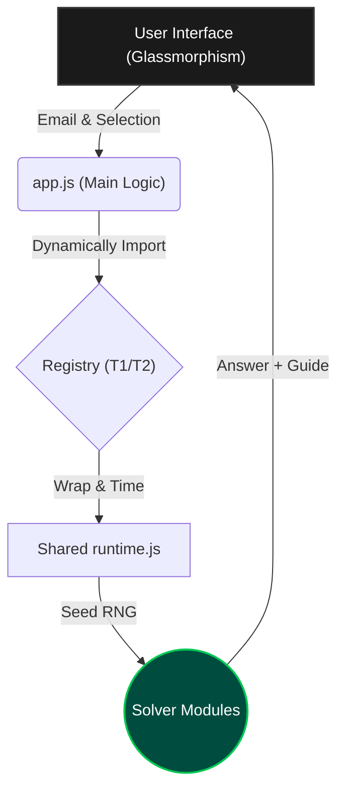

# TDS Exam Portal — Elite Workspace


<p align="center">
  
  
  
  
</p>

---

## 🌟 The Vision

**TDS Portal** is a production-grade, browser-based environment designed for the automated execution of deterministic solver logic. It serves as an essential companion for the **IIT Madras Tools in Data Science (TDS)** course, bridging the gap between complex exam requirements and reliable, instant solutions.

Built with a focus on **visual excellence** and **mathematical precision**, the portal dynamically orchestrates a suite of 70+ specialized solvers, delivering high-confidence results entirely on the client side.

---

## 🏗️ Core Architectural Pillars

### 1. Deterministic "God Nodes"
Consistency is the heartbeat of this project. Every computation is anchored by two immutable abstractions:
*   **`normalizeEmail()`**: Standardizes user input to prevent entropy.
*   **`rng()`**: A tightly controlled seeded random number generator. By injecting the normalized email as the seed, we guarantee that every random choice, array shuffle, and variable selection is 100% identical for a given user across any machine.

### 2. Modular Engine & Dynamic Registry
The system utilizes a "Registry" pattern, allowing it to scale across different terms and exams without bloat.
*   **Dynamic Imports**: Only the necessary solver modules are loaded based on the user's selection.
*   **Structured Contract**: Every solver adheres to a strict return contract: `{ answer, type, variant, answerDisplay, guide, debug }`.

### 3. Execution Flow


---

## 🎯 Exam Engine Capabilities

The portal supports a diverse range of exam targets, each with specialized logic:

| Engine | Scope | Key Highlights |
| :--- | :--- | :--- |
| **GA0 (T22026)** | Intro to Data Science | 25-question suite including **Implementation Guides** for FastAPI, ngrok, Ollama CORS, Forensic Drag & Drop Sandbox. |
| **ROE** | Re-exam Workflows | Complex regex golf, procedural maze solving, and programmatic computation. |
| **GA7** | Data Visualization | Diverging palette sampling, prompt reverse engineering, and chartjunk analysis. |
| **GA8** | MLOps & Cloud | Docker verification, GCP Cloud Run compute, and Gemini API extractors. |
| **Project 2** | Forensics & KB | **QR Repair (Solana Tracer)** and **Discourse KB Solver** (50-task massive aggregation). |

---

## ⚠️ Academic Integrity & Malpractice Prevention Lock

To fully prevent student malpractice and ensure compliance with the **IIT Madras Student Code of Conduct**, the portal integrates a high-visibility, interactive security guard directly on the home screen:

1. **Top-Of-Page Placement**: The "Academic Integrity & Malpractice Prevention Notice" card sits prominently at the absolute top of the welcome interface.
2. **Glowing Attention Pulse**: When unaccepted, the card continuously loops a custom red/amber warning glow animation (`pulse-attention`) to command immediate attention.
3. **Validation Lock & Checkbox**: All workspace initialization inputs are strictly locked. Users must read the terms and check the agreement box before proceeding.
4. **Active Intercept & Shake**: If a user attempts to bypass the lock and click "Initialize Workspace", the engine:
   - Blocks workspace initialization and halts solving.
   - Shows an error toast.
   - Smoothly scrolls the window to center the disclaimer card.
   - Triggers a powerful CSS keyframe shake animation (`shake-attention`) on the card to capture focus.
5. **Accepted Persistence**: Once checked, acceptance state is saved securely to `localStorage` for returning sessions.

---

## ✨ Premium Workspace UX & Credits

The UI is crafted to provide an IDE-like experience, moving beyond static result pages:

*   **Glassmorphic Design**: Modern dark mode with `backdrop-filter: blur(12px)` headers and curated HSL color palettes.
*   **🚀 Implementation Guides**: Dedicated success-themed panels for questions requiring manual steps (FastAPI, ngrok, CI/CD) ordered elegantly above computed answers.
*   **Creator Links & Credits**: Completely name-free creator credits featured in the sidebar footer and directly within the top navbar header. It features dynamic transitions, amber color transformations, and glow effects linking to verified LinkedIn and GitHub endpoints.
*   **Interactive Previews**: Integrated HTML iframes for rendering document outputs in real-time.
*   **Health Indicators**: Real-time badges for runtime speed, stability, and warning counts.
*   **Mobile-First Navigation**: A custom slide-out drawer utilizing natural document-flow scrolling for a fluid touch experience.

---

## 🛠️ Developer & Power User Guide

### Quick Start
Spin up the local development server with zero configuration:
```bash
npm install
npm start
```
🌐 **URL**: `http://localhost:3000/`

### Integrity & Smoke Testing
We maintain a rigorous testing suite to ensure no user-specific variants Regress.
```bash
npm run check
```
*Checks performed: Registry loading, Official order parity, Seeded RNG consistency, and Full GA0 execution coverage.*

---

## 💻 Technical Stack

*   **Frontend**: Vanilla HTML5, CSS3 (Glassmorphism), ES6+ Javascript.
*   **Libraries**: 
    *   `marked.js`: High-performance Markdown rendering.
    *   `prism.js`: Elegant syntax highlighting for code answers.
    *   `seedrandom`: Reliable deterministic entropy.
*   **Server**: Lightweight Node.js ESM static server with traversal protection.
*   **Deployment**: Fully compatible with **Vercel** via `vercel.json` configuration.

---

<p align="center">
  Built with ❤️ for the IITM TDS Community.
</p>
