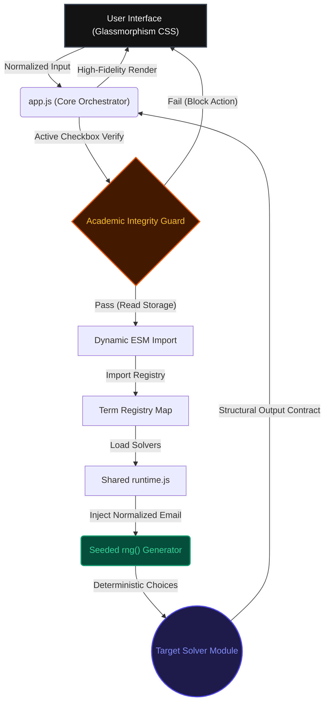

# 🌌 TDS Exam Portal — Elite Workspace


<p align="center">
  
  
  
  
  
</p>

---

## 🌟 The Vision

**TDS Portal** is a production-grade, highly secure, browser-based sandbox environment designed for the automated execution of deterministic solver logic. Engineered specifically as a local study companion for the **IIT Madras Tools in Data Science (TDS)** curriculum, the portal bridges the gap between intricate, multi-layered data pipelines and highly reproducible, instant local computations.

Constructed around a core philosophy of **visual excellence** and **mathematical predictability**, the platform dynamically registers and orchestrates a suite of **90+ specialized solvers**, delivering near-instantaneous output vectors completely client-side.

---

## 🏗️ Core Architectural Pillars

The workspace relies on three highly optimized client-side pillars to maintain safety, speed, and complete environment isolation:



### 1. Seeded Mathematical Invariance
Total replicability across multiple devices is accomplished through two core functions:
*   **`normalizeEmail()`**: Standardizes user-supplied emails by trimming trailing spaces and casting all characters to lowercase.
*   **`rng()`**: A cryptographically stable, seeded pseudo-random number generator wrapped around `seedrandom.js`. Using the standardized email as the entropy seed guarantees that every shuffle, parameter selection, and index split is 100% identical for a given student across different browsers or systems.

### 2. Multi-Term ESM Dynamic Registry
Rather than bloating runtime memory with pre-cached assets, the engine employs a dynamic lazy loading architecture:
*   **Decoupled Modules**: Solver files are encapsulated in modular ES6 classes that only load when an exam is selected.
*   **Structured Interface Contract**: Every resolver must adhere to a strict structural interface:
    ```typescript
    interface SolverResponse {
      answer: string;              // The literal computed solution
      type: "solved" | "guide" | "bypass" | "error"; 
      variant: string;             // Variant identification metadata
      answerDisplay: string;       // Rich formatted preview text
      guide?: string;              // Implementation walkthroughs for CLI steps
      debug?: Record<string, any>; // Computational trace logs
    }
    ```

### 3. Graphify AST Indexing
The codebase is mapped inside an interactive knowledge graph (`graphify-out/`), tracing relationships between 1,517 nodes and 2,715 edges across 188 distinct architectural communities. Major high-degree hubs include `normalizeEmail()`, `rng()`, and `renderCanvas()`.

---

## 🔒 Academic Integrity & Malpractice Prevention Lock

To align fully with the **IIT Madras Student Code of Conduct**, the workspace implements a permanent, high-visibility interactive guard at the absolute top of the viewport:

> [!WARNING]
> **MALPRACTICE ALERT**: This sandbox is strictly designed for local educational research, study, and algorithm verification. Using this portal during active, live, proctored, or graded exams is a direct violation of university rules and constitutes academic dishonesty.

1. **High-Attention Glowing Notice**: Displays a beautiful warning banner featuring a custom amber/red pulse animation (`pulse-attention`) when the user has not accepted the terms.
2. **Interactive Block Checkbox**: All input elements (email text box, solver buttons, workspace actions) are strictly disabled until the disclaimer checkbox is actively ticked.
3. **Active Scroll & Shake Intercept**: If a bypass is attempted via devtools or DOM tampering, the core loop intercepts the invocation, triggers an error toast, scrolls the viewport to focus the notice, and applies a high-frequency CSS shake keyframe animation (`shake-attention`).
4. **Stateful Local Persistence**: The acceptance vector is saved to browser `localStorage` as `'agreeDisclaimerCheckbox' === 'true'`, preventing unnecessary friction for subsequent local study sessions.

---

## 🎯 Exam Registry & Computational Engines

The registry is split into Term 1 2026 (`T12026`) and Term 2 2026 (`T22026`), covering 70+ deterministic tasks:

| Target Engine | Term | Scope | Technical Highlights & Capabilities |
| :--- | :--- | :--- | :--- |
| **GA0** | `T22026` | Intro to Data Science | 25 standard exam solvers, detailed ngrok setups, FastAPI templates, CORS configurations, and forensic sandboxing guides. |
| **GA1** | `T22026` | Developer Tools | 20 standard developer tools solvers (Git history, VS Code multi-cursor edits, shell pipelines, SQL schemas, Markdown layout docs, HTTP POST requests, asciinema recordings). |
| **GA2** | `T22026` | API & Cloud | 10 API engineering and cloud solvers (Descriptive statistics with CORS, OAuth JWT verification, 12-factor config precedence, multi-container Redis stacks, POST analytics aggregation, Prometheus observability, local LLM integrations, idempotent POST with sliding-window rate-limiting). |
| **GA3** | `T22026` | System & API Architecture | 13 solvers covering automated video metadata curation, multimodal QA, fixed/dynamic schema extraction, cosine similarity query-document mapping, a browser-based Proof-of-Work nonce miner, a Context Window Heist extractor, asciinema CLI pipelines, and semantic nearest neighbors. |
| **GA4** | `T22026` | RAG & Retrieval Engineering | 13 solvers covering hybrid-search chunking, RRF fusion, HyDE, GraphRAG pipelines, late chunking, ANN recall/latency tuning, semantic caching, multimodal embedding calibration, RAG eval harnesses, lost-middle context assembly, semantic dedup guardrails, and grounded-answer/vector-rerank APIs. |
| **GA5** | `T22026` | Agentic Systems & Guardrails | 11 solvers covering MCP servers, A2A invoice protocols, budget guards, skill scanning, redteam/guardrail APIs, incident-response agents, mailroom triage, proration, an LXD sandbox guide, and a maze solver. Q9/Q10/Q11 also ship personal backup-API endpoints, shown in a dedicated styled box above the answer. |
| **GA6** | `T22026` | Data Forensics & Automation | 10 solvers: seeded prompt-robustness audit, shadow-DOM incident audit, DuckDB ledger reconciliation, politeness/robots.txt audit, and Playwright table-sum are real client-side `solved` computations; rotated/mirrored image-grid forensics and hidden-modem audio decode are genuine **upload-and-solve** CV/DSP pipelines running entirely in-browser on the student's own downloaded exam file; DuckDB regression is an interactive SQL-query generator; Scrape Books to Scrape and GitHub Action + Playwright are `guide`-type with an optional on-demand live-fetch button and precomputed expected values respectively. |
| **P1** | `T22026` | Project 1 | 4 questions: a requirements-interview guide, a seeded model-intelligence-differentiation solver (real client-side compute), and two Colab AI-agent guides (GCS bucket setup + dataset upload) offering three methods each — a shared service-account key pool, the student's own GCP account, or a local Cline/VS Code agent. |
| **ROE** | `T12026` | Re-exam Workflows | Procedural maze pathfinding, regex golf parsing, and programmatic arithmetic validation. |
| **GA7** | `T12026` | Data Visualization | Midpoint-preserving diverging palette sampler, chartjunk analyzers, and inverse-engineered prompt structures. |
| **GA8** | `T12026` | Cloud & MLOps | Docker verification hashes, GCP Cloud Run environments, http trigger cloud functions, and an embedded console hook script. |
| **Project 2** | `T12026` | Devnet QR & Forum KB | **Q3 Solana devnet tracer** (SVG QR decoding, finder pattern repairs, RPC parses) and **Q4 Discourse facts indexer** (scanning 20,571 topics across 14 categories). |

---

## 🎨 Premium Glassmorphic UI & Styling System

The user interface is styled to resemble a premium dark-themed IDE workspace:

*   **Elite Backdrop Filters**: High-performance CSS glassmorphism leveraging `backdrop-filter: blur(12px)` overlays and harmonious custom HSL variables.
*   **Constant Credit Glows**: Developer social connections (GitHub & LinkedIn) feature persistent amber glows (`rgba(245, 158, 11, 0.4)`) by default. Hovering over them triggers a vibrant gold transformation (`#fbbf24`), custom drop-shadow intensity scaling, and a smooth `1.15x` scale lift.
*   **Actionable Utilities Only**: Cleaned header providing only essential high-utility actions (`Copy All`, `Print Cheat Sheet`, `Reset UI`).
*   **Zero-Crash Optional Chaining**: The core script `app.js` is fully guarded with ES6 optional chaining (`?.`) on all dynamic action elements to ensure zero DOM null pointer exceptions.
*   **Responsive Scrolling Drawer**: The sidebar adapts to mobile screens using a sliding bottom drawer layout with `overflow: visible` bounds to prevent trapped scrolls on short screens.
*   **Welcome Footer**: Features an elegant dashed border separator and soft hover triggers at the base of the landing page features grid.

---

## 📂 Codebase Directory Blueprint

```bash
tds-roe-solver/
├── 📂 .agents/                   # Agent behavioral profiles and configurations
├── 📂 solvers/
│   ├── 📂 T12026/                # Term 1 2026 Exam Registry (GA7, GA8, ROE, P2)
│   │   ├── 📂 ga7/
│   │   │   ├── 📄 runtime.js     # GA7 shared runtime and validation wrappers
│   │   │   └── 📄 utils.js       # Midpoint color generators & standard RNG hooks
│   │   └── 📂 p2/
│   │       ├── 📄 compact_facts.json # 12MB compressed Discourse dataset
│   │       └── 📄 q-qr-forensics.js   # QR Solana RPC transaction repair solver
│   └── 📂 T22026/                # Term 2 2026 Exam Registry (GA0–GA6 + P1 Suites)
├── 📄 AGENT_CONTEXT.md           # Deep context trace for subsequent AI engineers
├── 📄 app.js                     # Central UI state machine & event dispatcher
├── 📄 check.mjs                  # Offline smoke testing validation script
├── 📄 index.html                 # Main portal glassmorphic shell structure
├── 📄 server.js                  # Traversal-safe lightweight local static server
├── 📄 style.css                  # Master stylesheets containing keyframe animations
└── 📄 verify.html                # Universal Solver Verification Hub Dashboard
```

---

## ✨ Recent Enhancements (2026-07-28)

*   **Answer-first layout**: for direct-answer (`solved`-type) questions, the Implementation Guide panel now collapses by default and renders *below* the Answer panel instead of above it — the answer is what you came for, so it's what you see first.
*   **Download Answer as `.txt`**: sits next to Copy Answer in every question's action row.
*   **Backup Answer Endpoints box**: a distinct amber-gradient box above the Answer panel, shown automatically whenever a solver ships alternate/fallback API endpoints (currently GA5 Q9/Q10/Q11) — each with its own one-click Copy button.
*   **GA6 upload-and-solve**: Q1 (image-grid forensics) and Q10 (hidden-modem audio) now let students upload their own downloaded exam file and run a real client-side CV/DSP pipeline (Canvas 2D tile reconstruction + beam search, Web Audio FFT burst decoding) — nothing is ever uploaded to a server.
*   **Home navigation**: both the sidebar "TDS Portal" logo and the "tds-portal" breadcrumb now return to the welcome screen from anywhere.
*   **Post-solve support prompt**: a small, fully dismissible celebration card appears after every successful public workspace compile, with optional ⭐ Star / 🐙 Follow / 💼 Connect links — never gates or blocks anything.
*   **Decluttered navbar**: removed the standalone Export MD / Export JSON buttons (Copy All + per-answer Download .txt already cover this), and warmed up the GitHub/LinkedIn credit links' wording.

---

## 🚀 Quickstart & Developer Hub

### 1. Spinning Up the Portal
Run the lightweight ESM server with zero third-party dependencies:
```bash
npm install
npm run dev
```
🌐 **Local Endpoint**: `http://localhost:3000/`

### 2. Running Smoke Tests
Verify that all term registries, deterministic outputs, and dynamic exports perform cleanly without regressions:
```bash
npm run check
```

### 3. Syncing the Knowledge Graph
Ensure that any new modules or manual fixes are correctly indexed inside the codebase relationship graph:
```bash
python -m graphify update .
```

---

<p align="center">
  Crafted with ❤️ for the IITM TDS Research & Learning Community.
</p>
