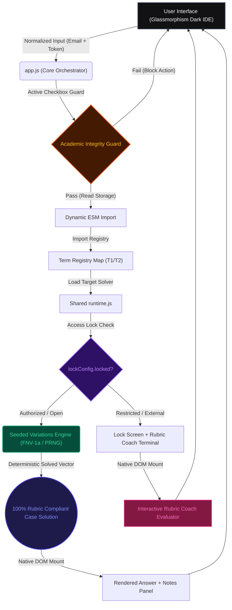

# 🌌 TDS Exam Portal — Elite Workspace


<p align="center">
  
  
  
  
  
  
</p>

---

## 🌟 The Vision

**TDS Portal** is a production-grade, highly secure, browser-based sandbox environment engineered for the automated execution, verification, and forensic analysis of deterministic computational solvers. Built specifically as an advanced study companion for the **IIT Madras Tools in Data Science (TDS)** degree curriculum, the portal bridges the gap between intricate, multi-layered data science pipelines and reproducible, instantaneous client-side computations.

Constructed around a core philosophy of **visual excellence**, **academic transparency**, and **mathematical determinism**, the platform registers and orchestrates **162+ specialized solvers across 14 exam suites**, delivering sub-millisecond output vectors, interactive diagnostic notes, and automated rubric evaluations 100% client-side.

---

## 🏗️ Core Architectural Pillars

The workspace relies on four highly optimized client-side subsystems to maintain absolute security, speed, and mathematical rigor:



### 1. Seeded Mathematical Invariance
Total replicability across multiple devices is accomplished through two core functions:
*   **`normalizeEmail()`**: Standardizes user-supplied emails by trimming trailing whitespace and casting all characters to lowercase.
*   **`rng()` / `createRng()`**: Cryptographically stable, seeded pseudo-random number generator wrapped around `seedrandom.js` and fast `FNV-1a` 32-bit hashing. Using the standardized email as the entropy seed guarantees that every shuffle, parameter selection, variation synthesis, and index split is 100% identical for a given student across different browsers or systems.

### 2. Combinatorial Variations Engine
For open-ended qualitative case studies (Project 2), the system features a dynamic linguistic generator:
*   **Plagiarism Prevention**: Permutes sentence formulations, evidentiary row orderings, and hypothesis refutations uniquely per student seed (`${email}:${questionId}`).
*   **Fact Invariance**: Guarantees that despite lexical divergence, 100% of underlying ground-truth data points (batch IDs, file paths, monetary sums, timestamp anomalies, and confidence ratings) remain intact.

### 3. Multi-Term ESM Dynamic Registry
Rather than bloating runtime memory with pre-cached assets, the engine employs a dynamic lazy loading architecture:
*   **Decoupled Modules**: Solver files are encapsulated in modular ES6 classes that only load when an exam is selected.
*   **Structured Interface Contract**: Every resolver must adhere to a strict structural interface:
    ```typescript
    interface SolverResponse {
      id?: string;                 // Canonical question identifier
      title: string;               // Display title
      answer: string;              // The literal computed solution / raw text
      type: "solved" | "guide" | "bypass" | "error"; 
      variant: string;             // Variant identification metadata
      answerDisplay: string;       // Rich formatted Markdown preview
      guide?: string;              // Implementation walkthroughs for CLI steps
      rubricCoachHtml?: string;    // Interactive Rubric Coach terminal component
      debug?: Record<string, any>; // Computational trace logs & benchmark stats
    }
    ```

### 4. Interactive Rubric Intelligence Terminal
Every case study workspace embeds a dedicated **Rubric Coach & Draft Evaluator**:
*   **Live Heuristic Parsing**: Analyzes user-drafted Markdown in real-time, validating heading skeletons (`## Judgment`, `## Evidence Table`, etc.), character count gates (`[150–3,000]` or `[200–6,000]`), and evidence matrix columns (`| Claim | Source | Confidence |`).
*   **Citation Density Matrix**: Scans draft text for high-impact entities (e.g. `DF-00020`, `Farah Iqbal`, `INV-17`, `~17.5%`, `9021.10.00`, `SUP-02`, `02:10:00`, `$123,565.26`).
*   **Live Scorecard**: Generates an instant rubric score (0–100%) with categorized passed checks, unmet criteria, and strategic recommendations.

---

## 🔒 Academic Integrity & Access Security

To align fully with the **IIT Madras Student Code of Conduct**, the workspace implements strict multi-layer protections:

> [!WARNING]
> **MALPRACTICE ALERT**: This sandbox is strictly designed for local educational research, study, algorithm verification, and rubric calibration. Using this portal during active, live, proctored, or graded exams is a direct violation of university rules and constitutes academic dishonesty.

1. **Mandatory Integrity Disclaimer**: All workspace inputs and solver executions are blocked until the user explicitly acknowledges the honor code checkbox.
2. **Configurable Access Locking (`lock-config.js`)**: Granular per-exam security locks allow developers to restrict programmatic answer generation to authorized whitelist emails while providing external students with the interactive Rubric Coach to verify their own manual work.
3. **Stateful Local Persistence**: The acceptance vector is saved to browser `localStorage` as `'agreeDisclaimerCheckbox' === 'true'`.

---

## 🎯 Complete Exam Registry & Computational Engines

The registry is split into Term 1 2026 (`T12026`) and Term 2 2026 (`T22026`), covering **162+ deterministic tasks across 14 exam suites**:

| Target Engine | Term | Scope | Technical Highlights & Capabilities |
| :--- | :--- | :--- | :--- |
| **P2** | `T22026` | **Project 2 — Forensic Case Studies** | **8 Case Studies (100 Marks)**: DTH Month-End Mystery (`DF-00020`/`$0.00`), DTH Complaints Quiet (NovaIVR/CareDesk dropouts, 5 diagnostic questions), Solar Inverter Smell Test (INV-17/0 MW telemetry), Solar 31.6% DSM Claim (within-day ~17.5% counterfactual decomposition), Swiss Customs Mismatch (tariff 9021.10.00 schema mapping), QC Queue Smell Test (02:10:00 AM QCore snapshot / 48h LabTrack latency), Irish Preference Claim (SUP-02 / P1006 / IE-2025-000411 2025 LTSD), and Spare-Parts Search ($123,565.26 inventory risk classification). Includes the full **Rubric Intelligence Terminal**. |
| **GA8** | `T22026` | **LLM Eval, Guardrails & MLOps** | **10 Solvers**: Automated RAG hallucination scanners, LLM benchmark pipelines, semantic guardrail firewalls, model drift analyzers, and Docker/Cloud Run deployment scripts. |
| **GA7** | `T22026` | Policy Gates & OSINT | **10 Solvers**: 5 hosted rule-engine APIs (release gates, LLM action firewall, Terraform policy, output sanitizer, OSINT corroboration); 4 seeded generators (Google-dork queries, WAF rule-order simulation, media forensics, GitHub Actions audit); Street View image intelligence. |
| **GA6** | `T22026` | Data Forensics & Automation | **10 Solvers**: Seeded prompt-robustness audit, shadow-DOM incident audit, DuckDB ledger reconciliation, politeness/robots.txt audit, client-side Canvas 2D tile reconstruction, Web Audio FFT burst decoding, and interactive SQL generators. |
| **GA5** | `T22026` | Agentic Systems & Guardrails | **11 Solvers**: MCP servers, A2A invoice protocols, budget guards, skill scanning, redteam/guardrail APIs, incident-response agents, mailroom triage, proration, and personal backup endpoints for Q9/Q10/Q11. |
| **GA4** | `T22026` | RAG & Retrieval Engineering | **13 Solvers**: Hybrid-search chunking, RRF fusion, HyDE, GraphRAG pipelines, late chunking, ANN recall/latency tuning, semantic caching, multimodal embedding calibration, and vector-rerank APIs. |
| **GA3** | `T22026` | System & API Architecture | **13 Solvers**: Automated video metadata curation, multimodal QA, fixed/dynamic schema extraction, cosine similarity mapping, browser-based Proof-of-Work nonce miner, Context Window Heist extractor, and asciinema pipelines. |
| **GA2** | `T22026` | API & Cloud | **10 Solvers**: Descriptive statistics with CORS, OAuth JWT verification, 12-factor config precedence, multi-container Redis stacks, POST analytics aggregation, Prometheus observability, and rate-limiting. |
| **GA1** | `T22026` | Developer Tools | **20 Solvers**: Git history analysis, VS Code multi-cursor edits, shell pipelines, SQL schemas, Markdown layout docs, HTTP POST requests, and asciinema recordings. |
| **GA0** | `T22026` | Intro to Data Science | **25 Solvers**: Standard exam solvers, detailed ngrok setups, FastAPI templates, CORS configurations, and forensic sandboxing guides. |
| **P1** | `T22026` | Project 1 | **4 Solvers**: Requirements-interview guide, seeded model-intelligence differentiation solver, and Colab AI-agent guides with shared service-account pools. |
| **ROE** | `T22026` | Re-Exam Suite | **12 Solvers**: Incident-atlas routing, Unicode ledger forensics, HTTP cache simulation with standalone offline Node.js CLI fallbacks, byte-verified hash/HMAC transcriptions, and audio/essay pre-flight checkers. |
| **ROE** | `T12026` | Re-exam Workflows | **15 Solvers**: Procedural maze pathfinding, regex golf parsing, and programmatic arithmetic validation. |
| **GA7 / GA8 / P2**| `T12026` | Data Viz, MLOps & Solana | **15 Solvers**: Midpoint diverging palette sampler, chartjunk analyzers, Docker verification hashes, Cloud Run triggers, and Solana devnet QR transaction repair + Discourse facts indexer. |

---

## 🎨 Premium Glassmorphic UI & Workspace Experience

The user interface is crafted to mirror an elite dark-themed IDE workspace:

*   **Glassmorphic Terminal Panels**: High-performance CSS glassmorphism leveraging `backdrop-filter: blur(16px)`, reactive focus glows matching the active color theme, and sub-pixel typography.
*   **Answer-First Visual Flow**: Solved answers are displayed immediately in high-contrast monospaced blocks, while implementation guides collapse cleanly below.
*   **Instant Utilities**: One-click **Copy Answer**, **Copy Variant**, **Download as `.txt`**, and **Focus Mode** toggles.
*   **Rubric Draft Toolkit**: Fast clipboard ingestion (`📋 Paste`), template loading (`📑 Insert Skeleton`), draft resetting (`🧹 Clear`), and live character/word counters with reactive boundary indicators (**Green** for valid gates, **Red** for violations).
*   **Vibe Audio Studio**: Built-in, non-intrusive ambient audio player with customizable local track loading via IndexedDB, custom equalizers, and theme-matched glowing animations.

---

## 📂 Codebase Architecture Blueprint

```bash
tds-roe-solver/
├── 📂 .agents/                   # Agent behavioral profiles and configurations
├── 📂 solvers/
│   ├── 📂 T12026/                # Term 1 2026 Exam Registry (GA7, GA8, ROE, P2)
│   │   ├── 📂 ga7/               # Midpoint color generators & standard RNG hooks
│   │   ├── 📂 ga8/               # Docker verification & Cloud Run triggers
│   │   ├── 📂 roe/               # Maze pathfinding & regex golf solvers
│   │   └── 📂 p2/                # Solana devnet QR & Discourse facts indexer
│   └── 📂 T22026/                # Term 2 2026 Exam Registry (GA0–GA8 + ROE + P1 + P2)
│       ├── 📂 ga0/ ... 📂 ga8/   # Modular deterministic solvers (GA0 through GA8)
│       ├── 📂 p1/                # Project 1 AI Agent & GCS setups
│       ├── 📂 p2/                # 🔥 Project 2 Case Study Engine & Rubric Coach
│       │   ├── 📄 case-specs.js  # Case boundaries, headings & rubric criteria
│       │   ├── 📄 rubric-coach.js# Rubric Coach terminal & draft evaluator
│       │   ├── 📄 lock-config.js # Access control configuration & whitelist
│       │   ├── 📄 runtime.js     # Solver execution wrapper & diagnostics
│       │   ├── 📄 variations-engine.js # PRNG variation & table generator
│       │   ├── 📄 registry.js    # Ordered question registry (1-to-1 live exam match)
│       │   ├── 📄 q-case-1a.js   # Case 1A: DTH Month-End Mystery
│       │   ├── 📄 q-case-1b.js   # Case 1B: DTH Complaints Went Quiet
│       │   ├── 📄 q-case-2a.js   # Case 2A: Solar Inverter Smell Test
│       │   ├── 📄 q-case-2b.js   # Case 2B: Solar 31.6% Impact Claim
│       │   ├── 📄 q-case-3a.js   # Case 3A: Swiss Mismatch Control
│       │   ├── 📄 q-case-4a.js   # Case 4A: QC Queue Smell Test
│       │   ├── 📄 q-case-3b.js   # Case 3B: Irish Preference Claim
│       │   └── 📄 q-case-4b.js   # Case 4B: Spare-Parts Search
│       └── 📂 roe/               # Re-Exam solvers & offline CLI fallbacks
├── 📂 scratch/                   # Automated Monte Carlo stress test harnesses
├── 📄 app.js                     # Central UI state machine & event orchestrator
├── 📄 check.mjs                  # Comprehensive multi-term test suite (14 modules)
├── 📄 index.html                 # Main portal glassmorphic shell structure
├── 📄 server.js                  # Traversal-safe lightweight local static server
├── 📄 style.css                  # Master stylesheets & Rubric Coach terminal styles
├── 📄 sw.js                      # Progressive Web App offline Service Worker
└── 📄 verify.html                # Universal Solver Verification Hub Dashboard
```

---

## 🚀 Quickstart & Developer Hub

### 1. Spinning Up the Portal
Run the lightweight ESM server with zero external dependencies:
```bash
npm install
npm run dev
```
🌐 **Local Endpoint**: `http://localhost:3000/`

### 2. Running the Full Test Suite
Verify that all 14 exam registries, deterministic outputs, character boundaries, and dynamic exports perform cleanly with 0 regressions:
```bash
npm run check
```

### 3. Running the Project 2 Rubric & Offline Evaluation Stress Test
Execute the 800-generation Monte Carlo simulation across 100 random student seeds:
```bash
node scratch/stress-test-raw-generator.js
```

---

<p align="center">
  Crafted with ❤️ for the IITM TDS Research & Learning Community.
</p>
