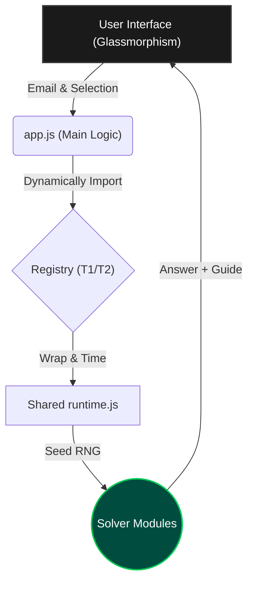

# TDS Exam Portal — Elite Workspace


<p align="center">
  
  
  
  
</p>

---

## 🌟 The Vision

**TDS Portal** is a production-grade, browser-based environment designed for the automated execution of deterministic solver logic. It serves as an essential companion for the **IIT Madras Tools in Data Science (TDS)** course, bridging the gap between complex exam requirements and reliable, instant solutions.

Built with a focus on **visual excellence** and **mathematical precision**, the portal dynamically orchestrates a suite of 70+ specialized solvers, delivering high-confidence results entirely on the client side.

---

## 🏗️ Core Architectural Pillars

### 1. Deterministic "God Nodes"
Consistency is the heartbeat of this project. Every computation is anchored by two immutable abstractions:
*   **`normalizeEmail()`**: Standardizes user input to prevent entropy.
*   **`rng()`**: A tightly controlled seeded random number generator. By injecting the normalized email as the seed, we guarantee that every random choice, array shuffle, and variable selection is 100% identical for a given user across any machine.

### 2. Modular Engine & Dynamic Registry
The system utilizes a "Registry" pattern, allowing it to scale across different terms and exams without bloat.
*   **Dynamic Imports**: Only the necessary solver modules are loaded based on the user's selection.
*   **Structured Contract**: Every solver adheres to a strict return contract: `{ answer, type, variant, answerDisplay, guide, debug }`.

### 3. Execution Flow


---

## 🎯 Exam Engine Capabilities

The portal supports a diverse range of exam targets, each with specialized logic:

| Engine | Scope | Key Highlights |
| :--- | :--- | :--- |
| **GA0 (T22026)** | Intro to Data Science | 25-question suite including **Implementation Guides** for FastAPI & GitHub Actions. |
| **ROE** | Re-exam Workflows | Complex regex golf, procedural maze solving, and programmatic computation. |
| **GA7** | Data Visualization | Diverging palette sampling, prompt reverse engineering, and chartjunk analysis. |
| **GA8** | MLOps & Cloud | Docker verification, GCP Cloud Run compute, and Gemini API extractors. |
| **Project 2** | Forensics & KB | **QR Repair (Solana Tracer)** and **Discourse KB Solver** (50-task massive aggregation). |

---

## ✨ Premium Workspace UX

The UI is crafted to provide an IDE-like experience, moving beyond static result pages:

*   **Glassmorphic Design**: Modern dark mode with `backdrop-filter: blur(12px)` headers and curated HSL color palettes.
*   **🚀 Implementation Guides**: (New) Dedicated success-themed panels for questions requiring manual steps (FastAPI, ngrok, CI/CD).
*   **Interactive Previews**: Integrated HTML iframes for rendering document outputs in real-time.
*   **Health Indicators**: Real-time badges for runtime speed, stability, and warning counts.
*   **Mobile-First Navigation**: A custom slide-out drawer utilizing natural document-flow scrolling for a fluid touch experience.
*   **One-Click Debugging**: Generate comprehensive JSON debug reports for troubleshooting.

---

## 🛠️ Developer & Power User Guide

### Quick Start
Spin up the local development server with zero configuration:
```bash
npm install
npm start
```
🌐 **URL**: `http://localhost:3000/`

### Integrity & Smoke Testing
We maintain a rigorous testing suite to ensure no user-specific variants silently regress.
```bash
npm run check
```
*Checks performed: Registry loading, Official order parity, Seeded RNG consistency, and Full GA0 execution coverage.*

### Knowledge Graph Integration
For developers working on core abstractions, the project includes a **Graphify Knowledge Graph**:
*   **Update Graph**: `python -m graphify update .`
*   **Context**: Refer to `AGENT_CONTEXT.md` for high-level design decisions and known gaps.

---

## 💻 Technical Stack

*   **Frontend**: Vanilla HTML5, CSS3 (Glassmorphism), ES6+ Javascript.
*   **Libraries**: 
    *   `marked.js`: High-performance Markdown rendering.
    *   `prism.js`: Elegant syntax highlighting for code answers.
    *   `seedrandom`: Reliable deterministic entropy.
*   **Server**: Lightweight Node.js ESM static server with traversal protection.
*   **Deployment**: Fully compatible with **Vercel** via `vercel.json` configuration.

---

<p align="center">
  Built with ❤️ for the IITM TDS Community.
</p>
